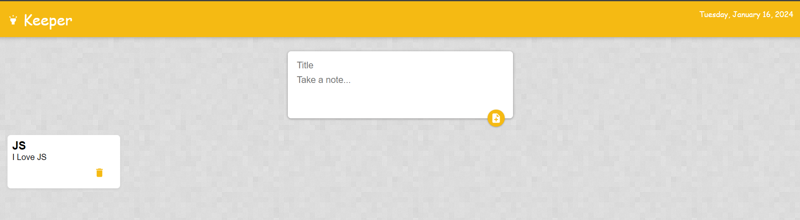

# Keeper App

## Description

Keeper App is a simple and intuitive note-taking web application designed to help users organize their thoughts, ideas. With a clean and user-friendly interface, it provides a seamless experience for creating, editing, and deleting notes.

Demo: [Keeper App Demo](https://rsingh1996.github.io/keeper-app/)

## Features

- Create and organize notes with a straightforward user interface.
- Edit and update notes easily for ongoing tasks and projects.
- Delete notes when they are no longer needed.
- Responsive design for optimal viewing on various devices.

## How to Use

1. Visit the [Keeper App Demo](https://rsingh1996.github.io/keeper-app/) page.
2. Click on the "New Note" button to create a new note.
3. Enter the title and content for your note.
4. Click the "Save" button to store the note.
5. Edit or delete notes using the respective buttons.

## Technologies Used

- HTML
- CSS
- React.js
- Material UI

## Contributing

Contributions are welcome! If you'd like to contribute to this project, please follow these steps:

1. Fork the project on GitHub.
2. Create a new branch for your feature (`git checkout -b feature/your-feature-name`).
3. Commit your changes (`git commit -m 'Add a new feature'`).
4. Push to your branch (`git push origin feature/your-feature-name`).
5. Create a Pull Request on GitHub.

## Issues

If you encounter any issues while using Keeper App or have suggestions for improvements, please [open an issue](https://github.com/rsingh1996/keeper-app/issues) on this GitHub repository.

## License

This project is licensed under the MIT License

---

Thank you for exploring the Keeper App! We hope it serves as a handy tool for organizing your notes and tasks efficiently.
